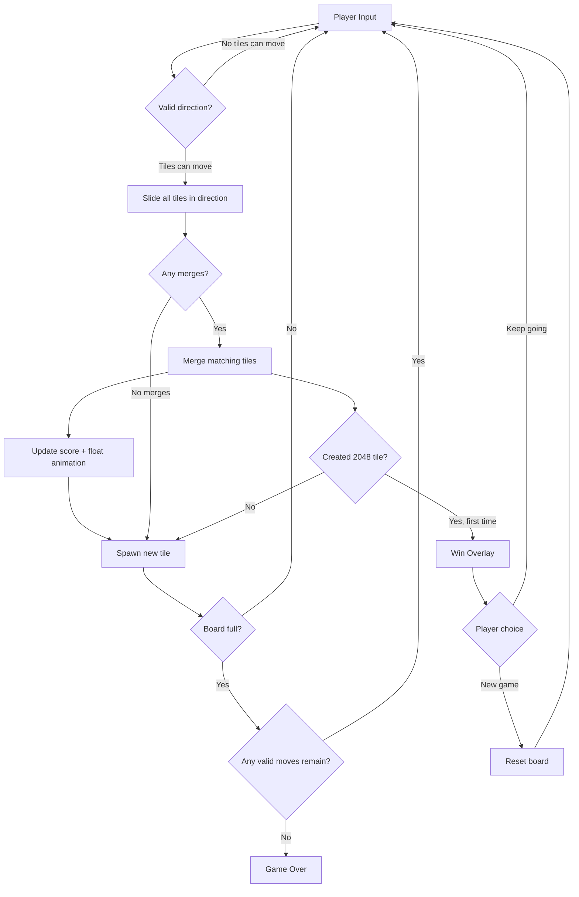
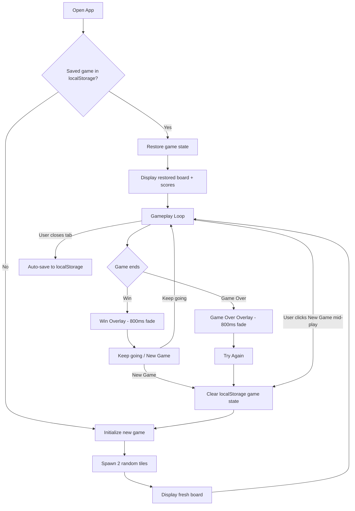
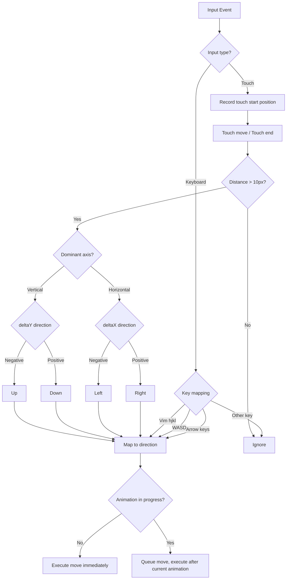

# UX Design Specification - try-bmad

**Author:** MiTi
**Date:** 2026-04-12

---

<!-- UX design content will be appended sequentially through collaborative workflow steps -->

## Executive Summary

### Project Vision

A faithful web-based recreation of the original 2048 puzzle game, built with Svelte + Tailwind CSS + Vite. The focus is on craft over novelty — deeply understanding and reproducing every detail of the original's mechanics and feel. The result serves as both a playable game and a learning artifact for modern web tooling.

### Target Users

- **Casual discoverers** — first-time players who expect intuitive, zero-instruction gameplay
- **Score chasers** — returning players who want persistent best scores and smooth "one more try" loops
- **Mobile players** — on-the-go users who need responsive touch controls and quick session support
- All users are general audience with no assumed technical knowledge; the game must teach itself through play

### Key Design Challenges

1. **Animation choreography** — slide, merge-bounce, pop, and score-float animations must layer cleanly at original timings (100ms/200ms) without visual conflict
2. **Input parity across devices** — swipe gestures must feel as precise and responsive as keyboard arrows; accidental swipes need mitigation (10px minimum threshold)
3. **State communication** — players must always see current score, best score, and game status (win/lose/in-progress); localStorage persistence must be invisible and reliable

### Design Opportunities

1. **Micro-interaction dopamine loop** — merge bounce + score float + tile pop create the satisfying feedback that drives "one more try" behavior
2. **Progressive visual feedback** — 12-tier tile color system and glow effects on 128+ tiles communicate progress without text, rewarding advancement naturally
3. **Zero-friction onboarding** — no tutorial needed; the UX stays out of the way and lets the game mechanics teach themselves

## Core User Experience

### Defining Experience

The core experience is the **directional slide** — a single input (arrow key or swipe) that triggers a cascade: tiles slide, identical values merge, score updates, a new tile spawns. This atomic interaction is the entire game loop. Every UX decision must serve this moment — making it feel instant, satisfying, and predictable.

### Platform Strategy

- **Platform:** Web SPA — browser-based, no installation, fully client-side
- **Desktop input:** Arrow keys (primary), WASD and Vim keys (secondary)
- **Mobile input:** Single-finger swipe with 10px minimum threshold to prevent accidental moves
- **Offline:** Fully functional once loaded — no server dependency at any point
- **Technology:** Pure web standards — CSS transitions for animation, localStorage for persistence, pointer/touch events for input

### Effortless Interactions

- **Slide-merge-score** feels like one continuous motion, not three sequential events
- **Game state persistence** is silent — no save button, no confirmation; refresh and your game is there
- **New Game** is a single tap — no "are you sure?" dialogs
- **Win-to-continue** transition is seamless — victory overlay appears, dismiss to keep playing
- **Input switching** between keyboard and touch works without mode selection

### Critical Success Moments

1. **First merge** — new player slides, two tiles combine, score ticks up. "I get it" moment.
2. **Near-death board** — 15/16 cells filled, every move consequential. Tension must feel exciting, not frustrating.
3. **Reaching 2048** — victory overlay feels earned; "Keep going" option is immediately visible.
4. **Page refresh recovery** — returning to an intact game builds implicit trust in the product.

### Experience Principles

1. **Responsive immediacy** — every input gets instant visual feedback; no action feels ignored or delayed
2. **Invisible infrastructure** — persistence, state management, and platform adaptation are imperceptible to the player
3. **Escalating tension** — UX amplifies the natural difficulty curve through visual density and tile color progression
4. **Respectful simplicity** — no tutorials, tooltips, or onboarding; the grid and starting tiles communicate everything

## Desired Emotional Response

### Primary Emotional Goals

- **Compulsive flow** — the player enters a rhythmic slide-merge-slide state where time blurs and "one more try" is the automatic response to every game over
- **Earned mastery** — each game teaches strategy implicitly; players feel themselves improving without instruction
- **Satisfying feedback** — every action produces visible, audible-feeling results; nothing feels ignored

### Emotional Journey Mapping

| Stage | Emotion | Design Driver |
|-------|---------|---------------|
| First open | Curiosity + clarity | Clean grid, two tiles, no clutter |
| First merge | Understanding + delight | Tile combine + score bump + pop animation |
| Mid-game | Focused absorption | Rhythmic input, rising numbers, pattern recognition |
| Near-death board | Thrilling tension | Board density signals urgency through visual weight |
| Game over | Brief disappointment → motivation | Score comparison triggers "I can beat that" |
| Reaching 2048 | Earned triumph | Victory overlay with seamless keep-going option |
| Return visit | Quiet trust | Game state intact on refresh |

### Micro-Emotions

- **Confidence over confusion** — the game never asks the player to figure out UI, only strategy
- **Accomplishment over frustration** — every game shows a score; every session has measurable progress
- **Excitement over anxiety** — tight boards feel thrilling, not punishing; color progression signals state naturally

### Design Implications

- **Flow state protection** → Animations must not block input; moves can queue during transitions to maintain rhythm
- **Merge delight** → Bounce animation (200ms) + score float create a micro-reward at the exact moment of success
- **Invisible trust** → localStorage persistence never surfaces; no save indicators, no failure states visible to player
- **Natural tension** → Tile color darkening and density communicate board state without explicit warnings or counters

### Emotional Design Principles

1. **Never break rhythm** — the player's input cadence is sacred; animations serve the flow, never interrupt it
2. **Reward every action** — even moves that don't merge should feel acknowledged through smooth tile sliding
3. **Signal through aesthetics** — color, size, and glow communicate game state; no text-based status needed
4. **Fail gracefully** — game over is a pause, not a punishment; the path to "try again" is instant

## UX Pattern Analysis & Inspiration

### Inspiring Products Analysis

**Original 2048 (play2048.co)** — direct reference
- Zero-chrome interface: grid is the entire product, header holds only score + best + new game
- No onboarding: two tiles on a grid teach the game in one interaction
- Animations layer without blocking input; score updates feel causally connected to merges
- Tile color encodes value — experienced players read color before numbers

**Wordle** — emotional arc reference
- Session structure creates anticipation; the attempt → result → retry loop drives retention
- Letter-by-letter reveal animation builds tension through pacing — analogous to merge-bounce micro-celebrations
- Minimal UI with maximum information density; every pixel serves gameplay

**Threes!** — mobile interaction reference
- Buttery smooth swipe with slight overshoot easing — gold standard for touch-based puzzle input
- Warm color palette and tile personality create emotional attachment to game pieces
- "Next tile" preview at screen edge reduces frustration (not used in 2048 for fidelity, but noted as design choice)

### Transferable UX Patterns

**Interaction Patterns:**
- **Zero-chrome layout** (from 2048) — the game grid dominates; UI elements are minimal and peripheral
- **Non-blocking animations** (from 2048) — input is never locked during transitions; moves can queue
- **Weighted swipe** (from Threes!) — touch input has momentum and intentionality; prevents accidental triggers

**Visual Patterns:**
- **Color-as-information** (from 2048) — tile color tiers encode value; players read color before number at higher levels
- **Micro-celebration timing** (from Wordle) — brief animation at moment of success creates dopamine without interrupting flow
- **Score causality** (from 2048) — "+N" float appears at merge location, visually linking action to reward

**Retention Patterns:**
- **"One more try" loop** (from all three) — game over → score comparison → instant restart with zero friction
- **Implicit learning** (from 2048/Threes!) — players develop strategy through play, not instruction

### Anti-Patterns to Avoid

- **Interstitial ads or pauses** — any interruption between game over and restart kills the retry loop
- **Tutorial overlays** — explaining a self-teaching game insults the player and delays the first merge moment
- **Confirmation dialogs on New Game** — friction on restart breaks the "one more try" impulse
- **Over-animated transitions** — animations longer than 200ms feel sluggish and break flow state
- **Score without context** — showing score without best-score comparison removes the motivational anchor

### Design Inspiration Strategy

**Adopt directly:**
- Original 2048's zero-chrome layout, tile color system, and animation timings — this is a faithful clone
- Non-blocking input during animations — critical for flow state preservation
- Instant restart with no confirmation — supports the retry loop

**Adapt for our stack:**
- CSS transitions in Svelte for slide/merge/pop — matching original timings (100ms/200ms) with Svelte's transition system
- Touch handling adapted from Threes! philosophy — weighted, intentional swipe with 10px threshold

**Explicitly avoid:**
- Any UI element not present in the original (no settings, no themes, no undo)
- Any animation that blocks the next input
- Any text-based instruction or tutorial

## Design System Foundation

### Design System Choice

**Tailwind CSS utility-first custom system** — no external component library.

All UI elements in this project are game-specific (tile grid, score display, overlays) with no equivalent in standard component libraries. Tailwind provides the systematic foundation (spacing, colors, transitions, responsive utilities) while allowing fully custom game components.

### Rationale for Selection

1. **Already in tech stack** — Tailwind CSS chosen in PRD; no additional dependency
2. **No applicable component library** — game UI is entirely bespoke (tiles, grid, overlays); Material/Ant/Chakra components don't apply
3. **Fidelity requirement** — faithful clone means matching the original's exact visual language, not adapting a design system's defaults
4. **Utility-first speed** — responsive breakpoints, transition timings, and color values are expressible as Tailwind config without writing raw CSS
5. **Purge-friendly** — unused utilities are stripped at build time, keeping bundle under 50KB target

### Implementation Approach

- **Tailwind config** defines the game's design tokens: tile colors (12-tier), font sizes (55/45/35px), grid dimensions (500px/280px), transition durations (100ms/200ms)
- **Svelte components** own their structure; Tailwind classes handle all styling
- **No CSS-in-JS** — pure utility classes + minimal custom CSS for animations (keyframes for pop/bounce)
- **Responsive** via Tailwind's breakpoint system with single 520px custom breakpoint

### Customization Strategy

- **Custom color palette** in `tailwind.config.js` matching original 2048 tile colors exactly
- **Custom spacing/sizing** for grid cells and container dimensions
- **Custom transition utilities** for game-specific animation durations
- **Minimal `@apply`** — prefer inline utilities; extract only for highly repeated tile-state styles

## Detailed Core User Experience

### Defining Experience

**"Slide tiles to merge and reach 2048."** The defining interaction is the directional slide that causes a merge — the moment two tiles combine into one higher number. Every UX decision serves this atomic moment: making it feel instant, predictable, and satisfying.

### User Mental Model

Players bring a spatial reasoning model: the grid is a physical space with gravity. "Push" all tiles in a direction. Same numbers touching after push = bigger number. The mental model matches the visual representation 1:1 — no abstraction layer, no learning curve. Players who have used any sliding puzzle or played the original 2048 have immediate transfer.

### Success Criteria

- **Input latency** < 16ms — slide must feel instant, never laggy
- **Merge position** matches expectation — result tile appears at leading edge of movement direction
- **Score causality** — "+N" float animation originates from merge location, visually linking action to reward
- **Sequence integrity** — new tile spawns after slide completes, never during; maintains predictable state
- **Input queuing** — next move can be registered during current animation; flow state never interrupted
- **State accuracy** — once-per-move merge rule enforced; no double-merges in single slide

### Novel UX Patterns

No novel patterns required. The directional grid slide is a fully established interaction pattern, perfected by the original 2048. Our approach is **faithful reproduction**, not innovation. The UX challenge is execution quality — matching the original's timings, easing curves, and feedback choreography — not inventing new interactions.

### Experience Mechanics

**1. Initiation**
- Desktop: Arrow key / WASD / Vim key press detected
- Mobile: Single-finger swipe exceeding 10px threshold in dominant direction
- Input ignored if no tiles can move in that direction (no state change = no animation)

**2. Slide Phase (100ms)**
- All movable tiles translate simultaneously toward input direction
- Tiles stop at grid boundary or when blocked by a different-value tile
- CSS transition with ease-in-out timing

**3. Merge Phase (200ms)**
- Identical adjacent tiles in movement path combine into sum value
- Merged tile plays bounce animation (scale 1.0 → 1.2 → 1.0)
- Only one merge per tile per move (once-per-move rule)
- Merge order: leading edge first (tiles closest to movement direction merge first)

**4. Score Update (600ms)**
- "+N" float animation rises from merge position and fades out
- Current score counter increments
- Best score updates if current exceeds previous best

**5. Spawn Phase (200ms)**
- Random empty cell selected for new tile
- 90% chance of value 2, 10% chance of value 4
- New tile plays pop animation (scale 0 → 1.0 with slight overshoot)

**6. State Evaluation (instant)**
- Check for 2048 tile → trigger win overlay (first time only)
- Check for available moves → if none, trigger game over overlay
- Save game state to localStorage

## Visual Design Foundation

### Color System

**Page & Grid:**
- Page background: `#faf8ef` (warm cream)
- Grid background: `#bbada0` (warm grey-brown)
- Empty cell: `#cdc1b4` (light taupe)

**Tile Color Tiers (12 levels):**

| Value | Background | Text Color | Notes |
|-------|-----------|------------|-------|
| 2 | `#eee4da` | `#776e65` | Light beige, dark text |
| 4 | `#ede0c8` | `#776e65` | Slightly darker beige |
| 8 | `#f2b179` | `#f9f6f2` | Orange, white text |
| 16 | `#f59563` | `#f9f6f2` | Deeper orange |
| 32 | `#f67c5f` | `#f9f6f2` | Red-orange |
| 64 | `#f65e3b` | `#f9f6f2` | Bright red |
| 128 | `#edcf72` | `#f9f6f2` | Gold + glow shadow |
| 256 | `#edcc61` | `#f9f6f2` | Deeper gold + glow |
| 512 | `#edc850` | `#f9f6f2` | Rich gold + glow |
| 1024 | `#edc53f` | `#f9f6f2` | Intense gold + glow |
| 2048 | `#edc22e` | `#f9f6f2` | Brightest gold + glow |
| 4096+ | `#3c3a32` | `#f9f6f2` | Dark (super tiles) |

**Glow effect** on 128+ tiles: `box-shadow: 0 0 30px 10px rgba(243, 215, 116, 0.4)`

**UI Colors:**
- Header text: `#776e65` (warm dark brown)
- Score box background: `#bbada0`
- Score box text: `#f9f6f2` (off-white)
- Button background: `#8f7a66` (brown)
- Button text: `#f9f6f2`
- Game over overlay: `rgba(238, 228, 218, 0.73)`
- Win overlay: `rgba(237, 194, 46, 0.5)`

### Typography System

**Font Family:** Clear Sans, Helvetica Neue, Arial, sans-serif

**Tile Number Sizes (dynamic by digit count):**
- 1 digit (2-8): `55px` bold
- 2 digits (16-64): `45px` bold
- 3 digits (128-512): `35px` bold
- 4 digits (1024-8192): `25px` bold
- 5+ digits: `15px` bold

**UI Typography:**
- Game title: `80px` bold, `#776e65`
- Score label: `13px` uppercase, `#eee4da`
- Score value: `25px` bold, `#f9f6f2`
- Subtitle/instructions: `18px`, `#776e65`
- Button text: `18px` bold, `#f9f6f2`
- Overlay message: `60px` bold

**Mobile scaling:** All tile font sizes reduce proportionally with the 280px/500px container ratio (0.56x)

### Spacing & Layout Foundation

**Desktop Layout (>520px):**
- Game container width: `500px`, centered
- Grid: `4x4`, cells `~106px` each
- Grid gap: `15px`
- Grid padding: `15px`
- Grid border-radius: `6px`
- Header padding: `0 0 40px 0`

**Mobile Layout (≤520px):**
- Game container: `280px` width
- Grid cells: `~57px` each
- Grid gap: `10px`
- Grid padding: `10px`
- Proportional scaling of all spacing

**Spacing Scale:**
- Base unit: `15px` (grid gap)
- Half: `8px` (inner tile padding)
- Double: `30px` (section gaps)
- Page margin: auto-centered with `max-width: 500px`

### Accessibility Considerations

- **Color contrast:** All tile text meets WCAG AA ratio against its background (dark text on light tiles, white text on dark tiles — transition happens at value 8)
- **Font sizing:** Minimum 15px even on smallest tiles; mobile sizes never drop below readable threshold
- **No color-only information:** Tile values are always displayed as numbers; color is supplementary, not the sole indicator
- **Keyboard accessible:** Full game playable with arrow keys; focus states for New Game button
- **Reduced motion:** Respect `prefers-reduced-motion` media query — disable animations, keep instant state updates

## Design Direction Decision

### Design Directions Explored

Since this is a faithful 2048 clone, design direction exploration focused on verifying that our visual foundation (colors, typography, spacing) accurately reproduces the original's look and feel, rather than exploring divergent visual approaches. A single HTML mockup was generated showing all game states.

**Mockup:** `_bmad-output/planning-artifacts/ux-design-directions.html`

**States verified:**
- Early game (sparse board, calm start)
- Mid-game (multi-tier color progression, building momentum)
- Near-death (15/16 filled, visual density signals tension)
- Game over (translucent white overlay, prominent message)
- Win (gold overlay, "Keep going" option)

### Chosen Direction

**Faithful reproduction of the original 2048 visual language** — warm cream background, earthy tile color progression, zero-chrome layout with grid as dominant element. No alternative directions considered because fidelity to the original is a core project requirement.

### Design Rationale

1. **Fidelity is the goal** — this project exists to faithfully recreate 2048, not to reinterpret it
2. **Proven visual language** — the original's color system, typography, and layout have been validated by millions of players
3. **Learning focus** — implementation quality matters more than design originality; the challenge is reproducing these visuals in Svelte + Tailwind
4. **Emotional alignment** — the warm, earthy palette supports the calm-to-tense emotional journey we defined

### Implementation Approach

- **Svelte components:** `App`, `Grid`, `Tile`, `ScoreBoard`, `GameMessage` — each owns its visual rendering
- **Tailwind config:** Custom color palette, font sizes, spacing scale, and transition durations matching original values
- **CSS animations:** Keyframe definitions for pop (new tile), bounce (merge), and fade (overlays) in global stylesheet
- **Responsive:** Single `@media (max-width: 520px)` breakpoint scales all dimensions proportionally

## User Journey Flows

### Journey 1: Core Gameplay Loop

The universal interaction cycle shared by all user personas.

**Key UX decisions in this flow:**
- Invalid moves (no tiles can move in direction) produce no animation, no state change — silent rejection
- Merge check happens during slide, not after — tiles merge as they collide
- Win detection only triggers once per game; subsequent 2048+ merges don't re-trigger
- Score float animation runs concurrently with spawn, not sequentially

### Journey 2: Game Lifecycle

Complete flow from app open to session end.

**Key UX decisions in this flow:**
- No "welcome screen" or splash — straight to game
- Saved game restores silently; player sees their board, not a loading screen
- New Game button works mid-game with no confirmation dialog
- Auto-save happens after every move, not on tab close (beforeunload is unreliable)

### Journey 3: Input Handling (Cross-Platform)

Detailed input flow covering keyboard and touch parity.

**Key UX decisions in this flow:**
- Touch uses dominant axis (larger delta) to determine direction — prevents diagonal ambiguity
- 10px minimum threshold prevents accidental swipes
- Input queuing during animations preserves flow state — player never feels "dropped"
- All keyboard mappings produce identical behavior — no preferential treatment

### Journey Patterns

**Feedback Pattern: Immediate Visual Response**
Every valid input produces visible change within one frame (16ms). Invalid inputs produce no change — silence is the feedback for "that didn't work."

**State Pattern: Invisible Persistence**
Game state saves after every move. Restore is silent. The player never interacts with save/load — it's infrastructure, not a feature.

**Recovery Pattern: Zero-Friction Restart**
From any state (mid-game, game over, win), one tap/click reaches a fresh board. No confirmation, no "are you sure," no transition screen.

### Flow Optimization Principles

1. **Minimum path to value:** App open → playing in 0 steps (restored game) or 0 steps (new game auto-starts)
2. **No dead ends:** Every terminal state (win, game over) has an immediate forward path (keep going, try again, new game)
3. **Silent error handling:** Invalid moves don't produce error messages; absence of response IS the feedback
4. **Concurrent animations:** Score float, tile spawn, and merge bounce can overlap — sequential would feel sluggish

## Component Strategy

### Design System Components

No external component library used. All components are custom Svelte components styled with Tailwind CSS utilities. The "design system" is the Tailwind config (custom colors, spacing, transitions) plus 5 game-specific components.

### Custom Components

#### `App.svelte` — Root Container

**Purpose:** Top-level layout orchestrator; holds game state, routes keyboard input, manages overlays
**Anatomy:** Header (title + scores) → subtitle row (instructions + New Game button) → Grid → GameMessage overlay
**States:** Playing, Won (overlay visible), Game Over (overlay visible)
**Interaction:** Listens for keyboard events on `window`; passes direction to game logic
**Accessibility:** `tabindex` on container for keyboard focus; `role="application"` for game context

#### `Grid.svelte` — Game Board

**Purpose:** Renders the 4x4 grid background with empty cell placeholders; positions Tile components
**Anatomy:** 4x4 CSS grid with `15px` gap; empty cells as background; tiles positioned absolutely over cells
**States:** Single state — always renders 16 cell backgrounds; tile count varies
**Props:** `tiles` array (each tile has `value`, `row`, `col`, `id`, `isNew`, `isMerged`)
**Interaction:** None — purely presentational; touch events handled at App level
**Accessibility:** `role="grid"`, `aria-label="Game board"`

#### `Tile.svelte` — Individual Tile

**Purpose:** Renders a single numbered tile with value-based color, font size, and animations
**Anatomy:** Rounded rectangle with centered number; color from 12-tier system
**States:**
- **Default:** Positioned at grid cell, value-based color and font size
- **Sliding:** CSS transition `transform` over 100ms to new position
- **New (spawning):** Pop animation — scale 0 → 1.0 over 200ms
- **Merged:** Bounce animation — scale 1.0 → 1.2 → 1.0 over 200ms
- **Glowing:** 128+ values get `box-shadow` glow effect
**Props:** `value`, `row`, `col`, `isNew`, `isMerged`
**Dynamic styling:** Font size tier (55/45/35/25/15px) based on digit count; background/text color from value lookup
**Accessibility:** `role="gridcell"`, `aria-label` with tile value

#### `ScoreBoard.svelte` — Score Display

**Purpose:** Shows current score and best score in styled boxes; animates score additions
**Anatomy:** Two side-by-side boxes — each with label ("SCORE"/"BEST") and numeric value
**States:**
- **Default:** Static display of score values
- **Score added:** "+N" float animation rises from score box and fades (600ms)
**Props:** `score`, `bestScore`, `scoreAddition` (triggers float animation)
**Accessibility:** `aria-live="polite"` on score value for screen reader updates

#### `GameMessage.svelte` — Overlay

**Purpose:** Displays win or game-over message with action buttons
**Anatomy:** Full-grid overlay with centered message text + action button(s)
**States:**
- **Hidden:** `opacity: 0`, `pointer-events: none`
- **Win:** Gold background overlay, "You win!" text, "Keep going" + "New Game" buttons
- **Game Over:** White semi-transparent overlay, "Game over!" text, "Try again" button
- **Transition:** 800ms opacity fade-in
**Props:** `type` ("win" | "gameover" | null), `onKeepGoing`, `onNewGame`
**Accessibility:** `role="alertdialog"`, `aria-modal="true"`, auto-focus on primary action button

### Component Implementation Strategy

**Build order follows dependency chain:**
1. `Tile` first — atomic unit, no dependencies, most complex styling
2. `Grid` — depends on Tile, handles positioning logic
3. `ScoreBoard` — independent, simple state
4. `GameMessage` — independent, overlay logic
5. `App` — orchestrates all components, owns game state

**Styling approach:**
- Tailwind utility classes for layout, spacing, colors
- Svelte `class:` directives for conditional tile states
- CSS `@keyframes` in `<style>` blocks for pop/bounce/fade animations
- Dynamic `style` attribute for tile positioning (`transform: translate`)

### Implementation Roadmap

**Phase 1 — MVP (core gameplay):**
- `App`, `Grid`, `Tile`, `ScoreBoard`, `GameMessage`
- All 5 components needed from day one — no phasing possible for a game this small
- Keyboard input only

**Phase 2 — Growth (persistence + mobile):**
- Add touch event handling to `App`
- Add localStorage save/restore logic to `App`
- Add score float animation to `ScoreBoard`
- Add slide/pop/bounce animations to `Tile`

**Phase 3 — Polish:**
- Add glow effect to `Tile` for 128+ values
- Add responsive sizing (all components scale at 520px breakpoint)
- Add `prefers-reduced-motion` support

## UX Consistency Patterns

### Button Hierarchy

**Primary Action** — `#8f7a66` background, `#f9f6f2` text, `18px` bold
- Used for: "New Game", "Try again", "Keep going"
- Hover: lighten background 10%
- Active: darken background 5%
- Always full-width within its container context
- No icons — text-only buttons throughout

**Button placement rules:**
- "New Game" always in subtitle row, right-aligned
- Overlay buttons always centered below message text
- Win overlay shows two buttons: "Keep going" (primary) + "New Game" (secondary, same style)
- Game over overlay shows single button: "Try again"

### Feedback Patterns

**Score Update Feedback:**
- "+N" text floats upward from score box, fades over 600ms
- Score counter increments immediately (no counting animation)
- Best score updates silently — no special animation, just value change

**Move Feedback:**
- Valid move: tiles slide (100ms) + optional merge bounce (200ms) + new tile pop (200ms)
- Invalid move (no tiles can move): no visual response at all — silence IS the feedback
- No sound effects, no haptic feedback — purely visual

**State Transition Feedback:**
- Win/game over: overlay fades in over 800ms
- New game: instant reset — no transition animation, board appears immediately with 2 tiles
- Page refresh restore: instant — board appears as-was, no loading indicator

### Overlay Patterns

**When to use:** Only for game-ending states (win, game over). Never for confirmations, settings, or informational messages.

**Visual design:**
- Full-grid coverage (overlays the game board only, not header/scores)
- Semi-transparent background (game board visible underneath)
- Centered message + action button(s)
- 800ms fade-in transition

**Behavior:**
- Overlays don't block keyboard input for restart (Enter key = primary action)
- No close button or click-outside-to-dismiss — only explicit action buttons
- Win overlay is dismissable (keep going); game over overlay requires action (try again/new game)

**Accessibility:**
- `role="alertdialog"` + `aria-modal="true"`
- Auto-focus primary action button on overlay appear
- Trap focus within overlay while visible

### Animation Patterns

**Timing Standards:**

| Animation | Duration | Easing | Trigger |
|-----------|----------|--------|---------|
| Tile slide | 100ms | ease-in-out | Every valid move |
| Tile pop (spawn) | 200ms | ease (scale 0→1) | New tile appears |
| Tile bounce (merge) | 200ms | ease (scale 1→1.2→1) | Tiles merge |
| Score float | 600ms | ease-out (translate + fade) | Score increases |
| Overlay fade | 800ms | ease | Win or game over |

**Animation Rules:**
1. Animations never block input — moves queue during transitions
2. Slide completes before spawn begins (sequential dependency)
3. Merge bounce and score float can run concurrently
4. All animations respect `prefers-reduced-motion` — replaced with instant state changes
5. No animation exceeds 800ms — keeps interactions feeling snappy

### State Communication Patterns

**How the game communicates state without text:**
- **Board density** = urgency (more tiles = more tension)
- **Tile color** = progress (beige → orange → red → gold)
- **Tile glow** = milestone (128+ values glow)
- **Overlay presence** = terminal state (win or game over)
- **Score comparison** = motivation (current vs. best)

**No explicit state indicators:** No move counter, no "tiles remaining" display, no difficulty label. The board IS the state display.

## Responsive Design & Accessibility

### Responsive Strategy

**Desktop (>520px):** Full 500px game container, centered on page. Keyboard-primary input. Generous spacing and full-size tile numbers. This is the primary experience.

**Mobile (≤520px):** Compact 280px game container, viewport-width adapted. Touch/swipe-primary input. Proportionally scaled typography and spacing. All functionality identical — no features removed on mobile.

**Tablet:** No special treatment — tablets >520px get desktop layout; smaller tablets get mobile layout. Touch input works at both sizes.

**No landscape/portrait distinction:** The game is a square grid — orientation doesn't affect layout.

### Breakpoint Strategy

**Single breakpoint: 520px** (matching original 2048)

| Property | Desktop (>520px) | Mobile (≤520px) |
|----------|-----------------|-----------------|
| Container width | 500px | 280px |
| Grid cell size | ~106px | ~57px |
| Grid gap | 15px | 10px |
| Grid padding | 15px | 10px |
| Title font | 80px | 45px |
| Tile font (1 digit) | 55px | 30px |
| Tile font (2 digits) | 45px | 25px |
| Tile font (3 digits) | 35px | 20px |
| Tile font (4 digits) | 25px | 14px |
| Score value font | 25px | 16px |
| Overlay message font | 60px | 35px |

**Approach:** Mobile-first CSS with `min-width: 520px` media query for desktop overrides. Tailwind's custom breakpoint in config.

### Accessibility Strategy

**WCAG Level: AA** — industry standard, appropriate for a public web game.

**Color & Contrast:**
- All tile text meets AA contrast ratio (4.5:1 for normal text)
- Dark text (#776e65) on light tiles (2, 4): ratio > 5:1
- White text (#f9f6f2) on colored tiles (8+): ratio > 4.5:1
- Tile values always shown as numbers — color is supplementary, never sole indicator

**Keyboard Accessibility:**
- Full game playable with keyboard only (arrow keys)
- `Tab` navigates to New Game button
- `Enter` activates focused button (including overlay actions)
- Focus visible indicator on New Game button (outline style)
- No keyboard traps — overlay auto-focuses action button, `Tab` cycles within overlay

**Screen Reader Support:**
- `role="application"` on game container (game-specific keyboard behavior)
- `role="grid"` on game board, `role="gridcell"` on tiles
- `aria-label` on tiles with value (e.g., "Tile: 128")
- `aria-live="polite"` on score display for value change announcements
- `role="alertdialog"` on win/game-over overlays

**Motion Sensitivity:**
- Respect `prefers-reduced-motion` media query
- When active: disable all CSS transitions and animations
- Game logic unchanged — only visual transitions removed
- Tiles appear instantly at new positions; overlays appear without fade

**Touch Targets:**
- New Game button: minimum 44x44px touch area
- Overlay action buttons: minimum 44x44px touch area
- Grid swipe: full grid area (500px/280px) is the touch target — no precision needed

### Testing Strategy

**Responsive Testing:**
- Chrome DevTools device emulation (iPhone SE, iPhone 14, iPad, desktop)
- Real device testing on at least one iOS and one Android device
- Verify touch swipe works reliably on real mobile hardware
- Test at 520px boundary — ensure breakpoint transition is clean

**Accessibility Testing:**
- Lighthouse accessibility audit (target: 100 score)
- Keyboard-only gameplay test (complete a full game without mouse/touch)
- `prefers-reduced-motion` toggle test (verify animations disabled)
- Color contrast checker on all tile color tiers
- Screen reader test with VoiceOver (macOS/iOS) for basic game state announcements

**Browser Support:**
- Chrome (latest), Firefox (latest), Safari (latest), Edge (latest)
- No IE11 support required
- Test CSS grid support (universal in modern evergreen browsers)

### Implementation Guidelines

**Responsive Development:**
- Use Tailwind's responsive utilities with custom `game` breakpoint at `520px`
- Container uses `max-width: 500px` + `margin: auto` for centering
- Grid dimensions use CSS custom properties for easy breakpoint switching
- Font sizes defined as Tailwind utilities with responsive variants

**Accessibility Development:**
- Semantic HTML: `<main>`, `<header>`, `<button>` — no divs-as-buttons
- ARIA attributes added directly in Svelte component templates
- Focus management: `element.focus()` on overlay appear, restore focus on dismiss
- `prefers-reduced-motion` check via CSS `@media` query — wrap all `transition` and `animation` properties
- Test with keyboard after every component implementation — don't backfill accessibility later
